<div align="center">

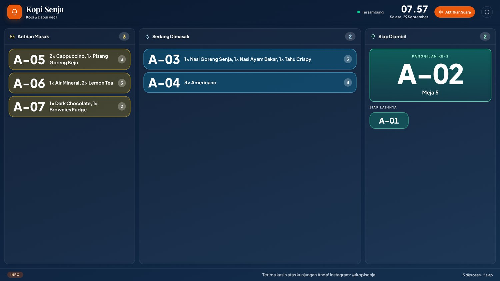

# byorderkasir

**POS + self-order untuk kafe & resto. Satu basis kode, lima layar, realtime sungguhan.**

[](src/domain)
[](#-ukuran-yang-dikirim-ke-pengguna)
[](#-teknologi-dan-alasannya)
[](LICENSE)

[Lihat layar](#-layarnya) · [Jalankan sendiri](#-jalankan-di-komputer-anda) · [Arsitektur](#-arsitektur) · [Status](#-status-dan-rencana)

</div>

---

Kasir, dapur, pelanggan, dan papan antrian sering berakhir sebagai empat aplikasi terpisah yang saling tidak tahu keadaan. Pesanan yang sudah dibayar masih muncul di tagihan, nomor antrian melompat, dan papan di ruang tunggu menampilkan data yang sudah basi beberapa menit.

**byorderkasir** menyatukannya: satu basis kode, satu sumber kebenaran, dan satu kanal realtime yang membuat semua layar bergerak bersamaan tanpa ada yang perlu menekan tombol muat ulang.

Dibangun sebagai pengganti modern dari aplikasi POS berbasis Google Apps Script + Google Sheets, dengan tiga hal yang di aplikasi lama justru jadi masalah utama:

| | Aplikasi lama | byorderkasir |
|---|---|---|
| **Realtime** | Polling tiap 6 detik | Siaran antar-layar, tanpa polling |
| **Harga** | Dihitung di browser pelanggan | Dihitung di lapisan domain, browser hanya menampilkan |
| **PIN admin** | Tertanam di kode yang dikirim ke browser | Sesi dengan masa berlaku, tidak ada PIN di klien |
| **Gambar menu** | Tidak ada | Setiap menu punya gambar, ada bawaan otomatis |
| **Struk** | Tabel dua kolom, melar di kertas termal | Daftar linear 80mm, `Rp` konsisten |
| **Ukuran** | 128,8 KB gzip (halaman admin) | 20,4 KB gzip |

---

## 📸 Layarnya

### Papan antrian — ditaruh di TV ruang tunggu

Nomor yang dipanggil tampil besar, sisanya tersusun tiga kolom mengikuti alur kerja dapur. Nama menu panjang turun ke baris kedua, tidak dipotong.


### Kasir — kartu menu bergambar

Setiap menu punya gambar. Belum ada foto? Otomatis dapat gambar bawaan sesuai kategori, jadi daftar tidak pernah tampak kosong.

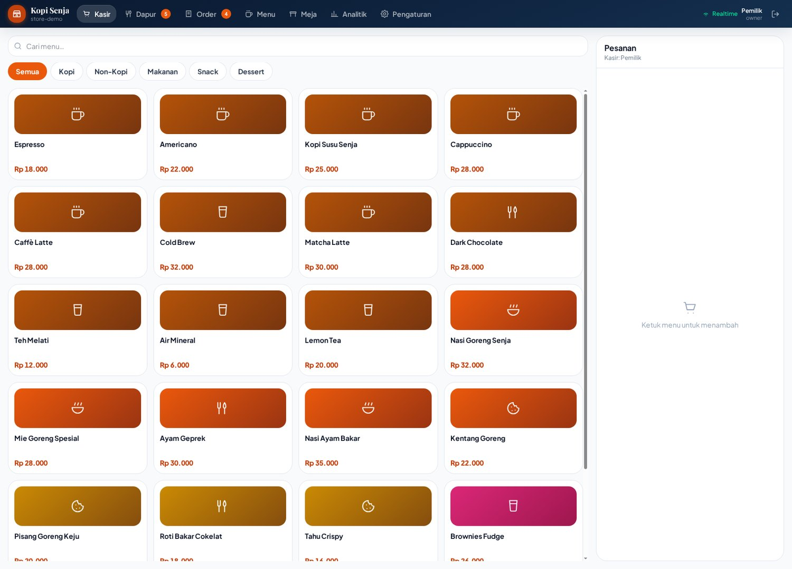

### Dapur — papan kerja tiga kolom

Kartu berubah warna mengikuti lama menunggu. Tombol aksi berganti sesuai tahap, dan posisinya selalu di ketinggian yang sama supaya tidak salah tekan saat sibuk.

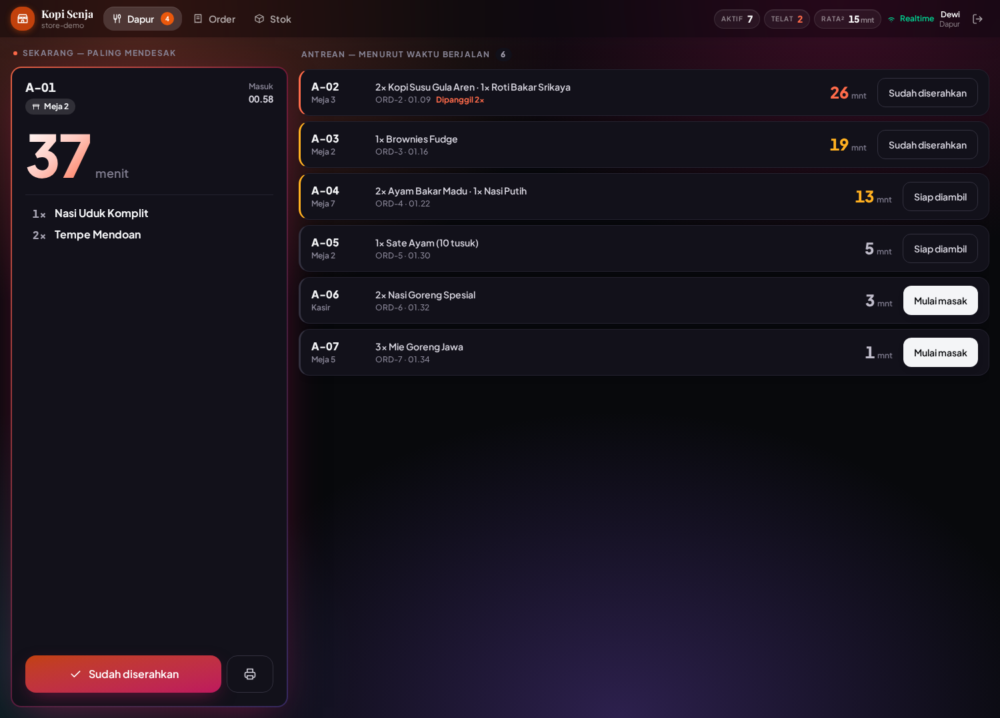

### Bayar — QRIS dinamis di layar pelanggan

Nominalnya disisipkan ke dalam QR, termasuk kode unik, sehingga pembayaran masuk bisa dicocokkan otomatis. QR dibuat di dalam aplikasi — token meja tidak pernah lewat layanan pihak ketiga.

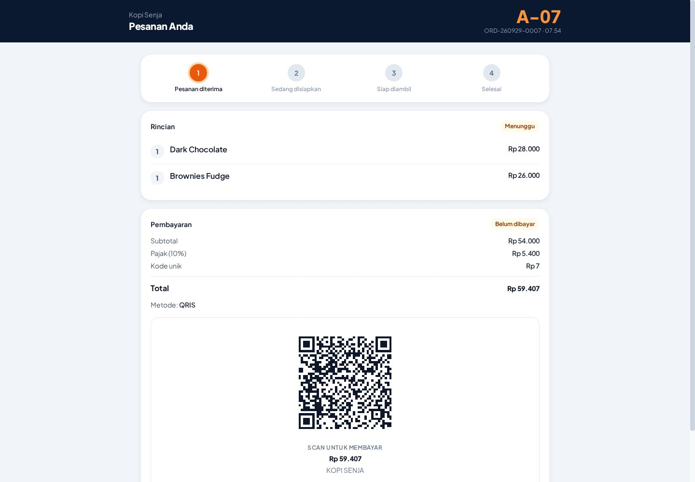

<table>
<tr>
<td width="50%">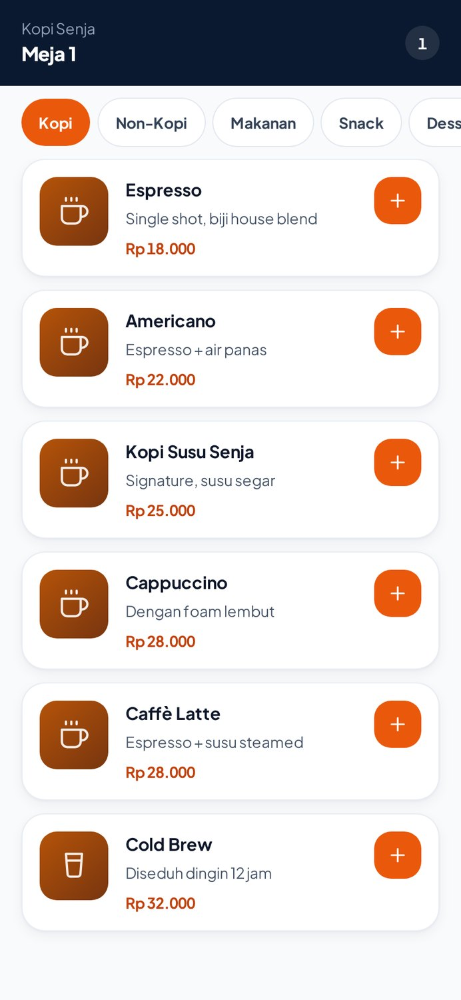<br><b>Pesan dari meja</b> — pelanggan memindai QR di meja, memesan langsung dari ponselnya.</td>
<td width="50%">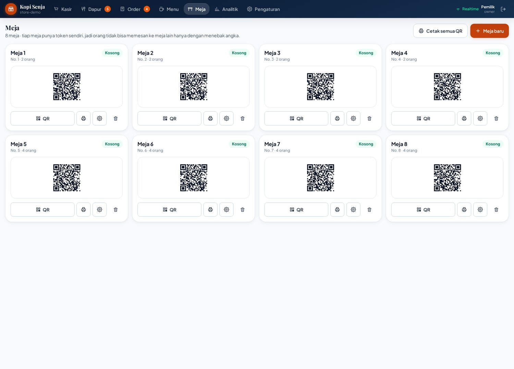<br><b>Kelola meja</b> — tiap meja punya token sendiri, jadi orang tidak bisa memesan ke meja lain hanya dengan menebak angka.</td>
</tr>
<tr>
<td>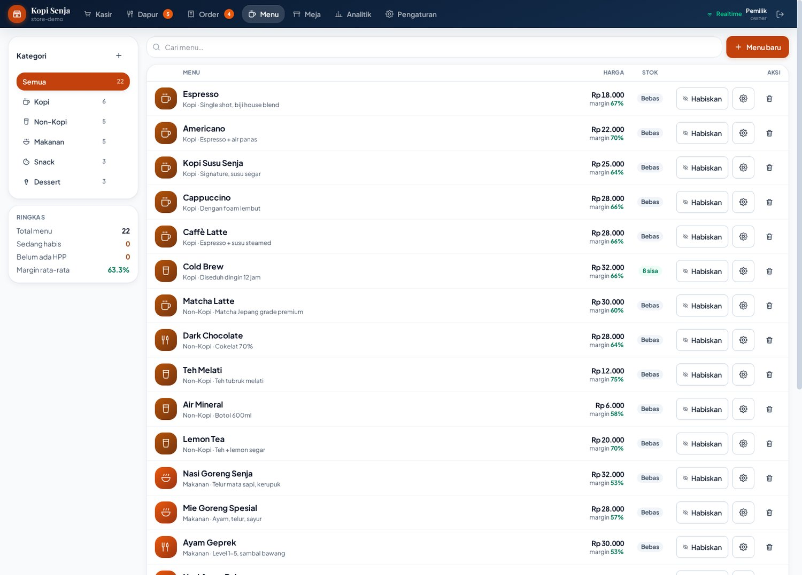<br><b>Kelola menu</b> — kategori, harga, HPP, gambar, dan ketersediaan.</td>
<td>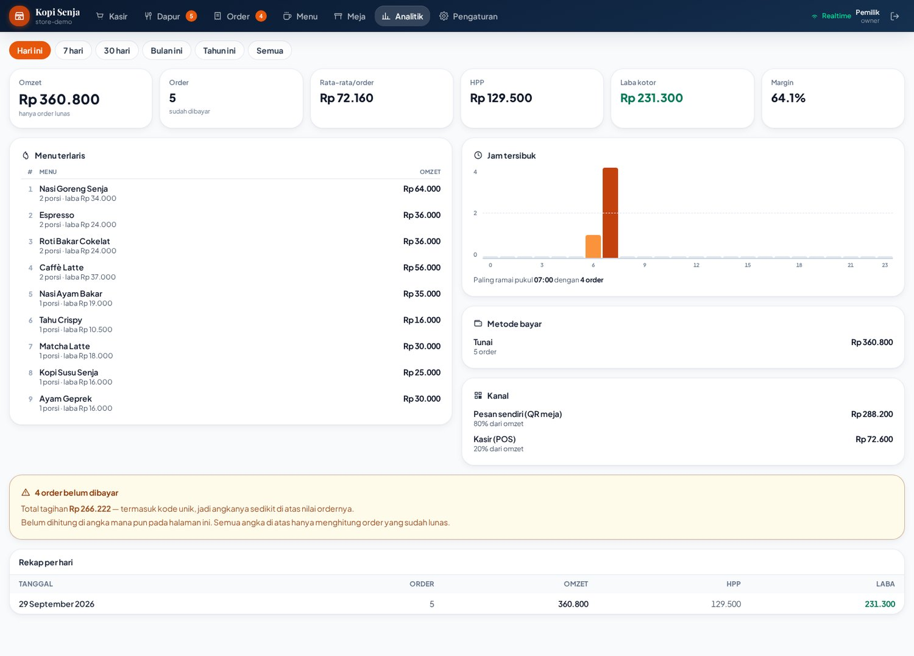<br><b>Analitik</b> — omzet, laba kotor, menu terlaris, sebaran jam dan kanal.</td>
</tr>
</table>

<details>
<summary><b>Layar lain</b> (beranda, daftar order, pengaturan)</summary>
<br>
<table>
<tr>
<td width="50%">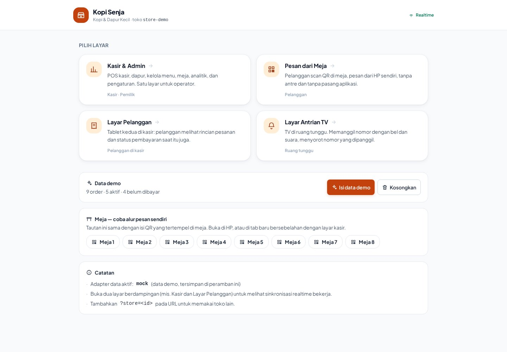<br><b>Beranda</b> — pemilih layar.</td>
<td width="50%">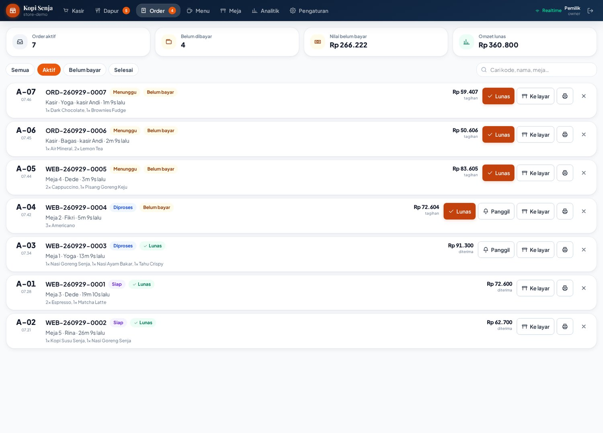<br><b>Daftar order</b> — riwayat dan penyaring.</td>
</tr>
</table>
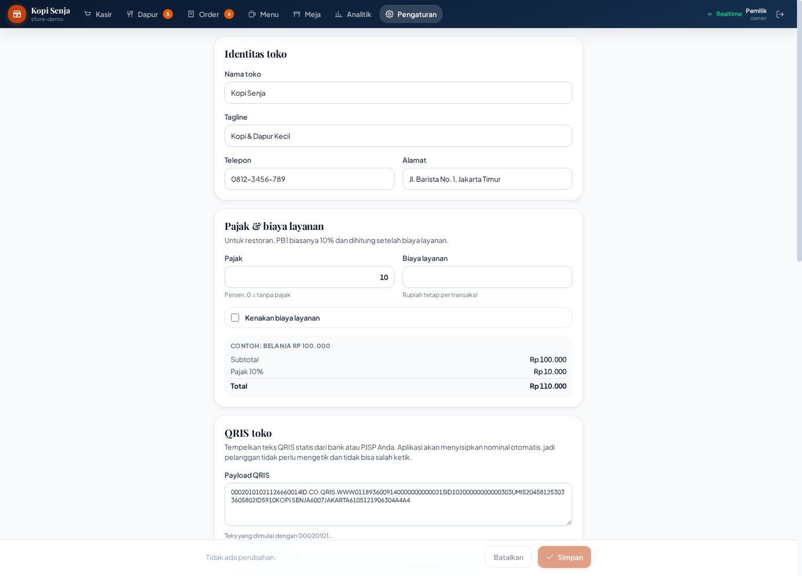
</details>

---

## 🧭 Lima layar, satu basis kode

| Layar | Alamat | Dipakai oleh | Isi |
|---|---|---|---|
| **Beranda** | `/` | Operator | Pemilih layar, penunjuk arah |
| **Kasir & Admin** | `/admin/` | Kasir, pemilik | 7 tab: Kasir, Dapur, Order, Menu, Meja, Analitik, Pengaturan |
| **Pesan dari meja** | `/order/?t=<token>` | Pelanggan | Menu, keranjang, kirim pesanan |
| **Layar bayar** | `/display/` | Pelanggan | Rincian pesanan, tahapan, QRIS |
| **Antrian** | `/queue/` | TV ruang tunggu | Panggilan nomor, tiga kolom, suara |

---

## ✨ Yang membuatnya berbeda

- **Realtime tanpa polling.** Satu kanal siaran (`BroadcastChannel`) menandai perubahan revisi; setiap layar memuat ulang hanya saat datanya memang berubah. Papan antrian ikut bergerak begitu kasir menekan tombol.
- **Harga ditentukan satu tempat.** Pelanggan hanya mengirim `menuId` dan jumlah. Total, pajak, dan kode unik dihitung di lapisan domain — bukan di browser yang bisa diubah siapa saja.
- **Alur pesanan sebagai mesin keadaan.** `pending → processing → ready → completed`, dengan pembatalan yang punya aturan sendiri. Tidak ada transisi liar, dan setiap aturan ada tesnya.
- **Kode unik hanya untuk pembayaran yang membutuhkannya.** QRIS dan transfer dapat kode unik supaya bisa dicocokkan; tunai tidak, karena uangnya sudah di tangan.
- **QR dibuat lokal.** Token meja dan payload QRIS tidak pernah dikirim ke layanan QR pihak ketiga.
- **Struk termal yang benar-benar muat.** 80mm, jarak 3mm, daftar linear — bukan tabel dua kolom yang melar di kertas sempit. Ada juga lembar A4 untuk mencetak QR semua meja sekaligus.
- **Analitik yang jujur.** Semua angka uang hanya menghitung order yang sudah lunas. Order yang belum dibayar ditampilkan terpisah sebagai piutang, tidak diam-diam ikut dihitung sebagai pemasukan.
- **Peran menentukan layar, bukan sekadar label.** Kasir, dapur, dan pemilik masuk dengan akun masing-masing; yang muncul hanya layar yang memang jadi tugasnya. Layar yang tidak diizinkan **dialihkan**, bukan ditolak dengan pesan galat — orang yang salah mengetuk pintu diantar ke pintu yang benar.
- **Realtime sungguhan lintas perangkat.** Bukan `BroadcastChannel` antar-tab, melainkan websocket ke server kecil tanpa dependensi. Satu perangkat menekan "bayar", papan antrian di perangkat lain bergerak. Ada jalur cadangan antar-tab saat server tidak tersedia.
- **Stok dengan riwayat dan peringatan.** Setiap penjualan mencatat pergerakan beserta saldonya, jadi pertanyaan "kenapa stok berkurang 5 padahal penjualan 3" punya jawaban yang bisa dibuka. Bahan yang menipis muncul di atas sebelum dapur kehabisan.
- **Laporan yang bisa dibuka di Excel.** CSV dan `.xlsx` asli — lima sheet, angka tetap bertipe angka, lebar kolom terpasang. Penulis XLSX-nya ditulis sendiri, tanpa dependensi.
- **Tetap jalan saat jaringan putus.** Perubahan masuk antrean tulis di perangkat dan dikirim ulang saat tersambung; ada penanda kecil di header yang menunjukkan ada berapa tulisan menunggu.
- **Halaman yang sama sekali tidak butuh backend untuk dicoba.** Lapisan data berupa antarmuka dengan implementasi mock; cukup buka, dan semuanya berjalan.

---

## 🚀 Jalankan di komputer Anda

Butuh **Node.js 20+**. Tidak ada langkah build tambahan.

```bash
git clone https://github.com/cupizfree/byorderkasir.git
cd byorderkasir
npm install
npm run dev
```

Buka `http://localhost:5173`. Untuk masuk ke panel admin, gunakan tombol **Isi otomatis** di halaman masuk, lalu tekan **Masuk**.

<details>
<summary><b>Menyiapkan data contoh</b></summary>
<br>

Jalankan di konsol browser saat halaman admin terbuka:

```js
const b = window.__byorder;
b.repo.resetDemoData();
await b.repo.seedDemoOrders();
```

`window.__byorder` hanya tersedia di mode pengembangan. Isinya 8 meja, menu lengkap dengan gambar bawaan, dan sepuluh order dengan umur berbeda-beda supaya indikator keterlambatan di layar dapur benar-benar terlihat bekerja.
</details>

<details>
<summary><b>Melihat papan antrian dan layar pelanggan</b></summary>
<br>

Buka di tab terpisah:

- Papan antrian — `http://localhost:5173/queue/`
- Layar pelanggan — `http://localhost:5173/display/`
- Pesan dari meja — `http://localhost:5173/order/?t=demo-token-1`

Biarkan papan antrian terbuka, lalu ubah status sebuah order dari tab admin. Papan itu bergerak sendiri tanpa dimuat ulang — itulah kanal realtime-nya.
</details>

### Perintah lain

```bash
npm run test        # 236 tes, tanpa kerangka pengujian tambahan
npm run typecheck   # pemeriksaan tipe
npm run check       # keduanya sekaligus
npm run build       # build produksi ke dist/
npm run preview     # pratinjau hasil build
npm run realtime    # server websocket lintas-perangkat di port 8787
```

Server realtime itu opsional. Tanpa dijalankan, aplikasi memakai kanal antar-tab dan tetap bekerja — hanya saja dua perangkat berbeda tidak saling melihat. Untuk mencoba lintas-perangkat, jalankan `npm run realtime` di satu terminal, lalu setel alamatnya saat menjalankan dev server:

```bash
VITE_REALTIME_URL=ws://192.168.1.10:8787 npm run dev
```

Ganti alamat itu dengan IP komputer yang menjalankan servernya, supaya ponsel di jaringan yang sama bisa menyambung.

Kalau `VITE_REALTIME_URL` dibiarkan kosong, kanal websocket **tidak dinyalakan sama sekali** — bukan menebak alamat lain. Aplikasi tetap berfungsi penuh lewat kanal antar-tab, hanya saja antar-perangkat tidak tersambung. Untuk mencobanya tanpa membangun ulang, setel dari konsol peramban:

```js
globalThis.__REALTIME_URL = 'ws://192.168.1.10:8787'
```

---

## 🏗 Arsitektur

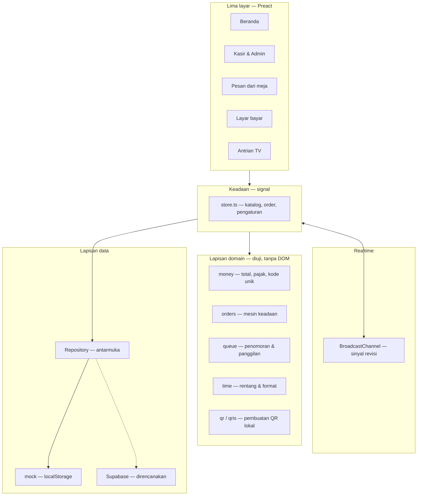

**Arah ketergantungannya satu arah.** Layar memakai keadaan, keadaan memakai domain dan antarmuka data, domain tidak tahu apa-apa soal layar. Karena itu seluruh aturan uang dan alur pesanan bisa diuji tanpa browser.

<details>
<summary><b>Struktur folder</b></summary>
<br>

```
src/
├── domain/            Aturan murni, tanpa DOM — semuanya ada tesnya
│   ├── types.ts       Bentuk data: Order, Menu, Payment, StoreSettings
│   ├── money.ts       Total, pajak, kode unik, ringkasan laporan
│   ├── orders.ts      Mesin keadaan pesanan & pembayaran
│   ├── queue.ts       Penomoran antrian & panggilan
│   ├── qr.ts          Pembuatan QR dari nol (uqr)
│   ├── qris.ts        Payload QRIS dinamis
│   └── time.ts        Rentang tanggal & format waktu
├── data/
│   ├── repository.ts  Antarmuka Repository — kontraknya
│   ├── mock/          Implementasi localStorage + data contoh
│   └── index.ts       Pemilih implementasi
├── state/
│   └── store.ts       Signal, pemuatan, dan jembatan realtime
├── ui/                Komponen bersama: Button, Card, MenuThumb, QrCode
├── surfaces/          Satu folder per layar
│   ├── home/  admin/  order/  display/  queue/
└── styles/
    └── app.css        Token desain, CSS cetak struk & lembar QR
```

</details>

---

## 🧰 Teknologi dan alasannya

| Pilihan | Alasan |
|---|---|
| **Preact** | Reaksi yang sama dengan React pada sepersepuluh ukuran — penting karena aplikasi ini juga dibuka dari ponsel pelanggan di jaringan seluler |
| **Vite** | Lima titik masuk dalam satu basis kode, dengan pemuatan terpisah per layar |
| **Tailwind 4** | Token desain di satu berkas; ukuran akhir lebih kecil karena hanya kelas yang dipakai yang ikut |
| **@preact/signals** | Pembaruan keadaan tanpa langganan yang bocor, dan bisa dibaca dari luar komponen |
| **uqr** | QR dibuat di dalam aplikasi, tanpa layanan pihak ketiga |
| **`node --test`** | Sudah ada di Node — tidak perlu memasang kerangka pengujian |

### Ukuran yang dikirim ke pengguna

Diukur dari hasil build produksi, terkompresi:

| Berkas | gzip |
|---|---|
| Admin (terbesar) | 27,2 KB |
| Inti bersama | 16,6 KB |
| Preact | 8,1 KB |
| QR | 5,4 KB |
| Pesan dari meja | 4,5 KB |
| Antrian | 3,9 KB |
| Layar bayar | 2,4 KB |
| Beranda | 2,0 KB |
| Gaya (semua layar) | 13,0 KB |

Admin tumbuh dari 20,4 KB ke 27,2 KB setelah peran, stok, laporan, dan penulis XLSX masuk. Kenaikannya nyata tapi masih di bawah seperlima aplikasi aslinya (128,8 KB) — dan penulis XLSX ikut di dalamnya, bukan dependensi terpisah.

Pelanggan yang memesan dari meja **tidak** mengunduh seluruh aplikasi kasir. Yang benar-benar terkirim saat halaman pesan dibuka, diukur dari hasil build produksi:

| Berkas | Terkompresi |
|---|---|
| Font Plus Jakarta Sans | 26,7 KB |
| Gaya bersama | 13,3 KB |
| Keadaan & data | 12,8 KB |
| Preact | 8,1 KB |
| Halaman pesan | 4,5 KB |
| Thumbnail menu | 1,2 KB |
| **Total** | **66,6 KB** |

Satu berkas font memakan hampir setengahnya, karena diunduh utuh untuk seluruh rentang ketebalan. Memangkasnya lewat subsetting adalah cara termurah untuk menurunkannya lagi — masih di daftar rencana.

---

## ✅ Pengujian

```bash
npm run test
```

**236 tes, semuanya lolos.** Yang diuji adalah aturan yang mahal kalau salah:

- Perhitungan uang: pajak, pembulatan, kode unik, ringkasan laporan
- Kode unik hanya diberikan untuk QRIS dan transfer — tunai tidak
- Hanya order lunas yang masuk omzet; order batal tidak pernah masuk, meski sudah dibayar
- Mesin keadaan pesanan: transisi sah, transisi terlarang, aturan pembatalan
- Penomoran antrian dan pemanggilan ulang
- Geometri QR: zona tenang, ukuran modul, hasil yang bisa dipindai
- Payload QRIS dinamis: nominal tersisip, pemeriksaan jumlah
- Rentang tanggal dan format waktu
- **Izin per peran:** siapa boleh membuka layar apa, dan ke mana dialihkan kalau tidak boleh
- **Stok:** saldo sejalan dengan riwayat pergerakan, ambang peringatan, arah dan alasan
- **Antrean tulis luring:** urutan kirim, percobaan ulang, batas percobaan, tulis yang gagal
- **CSV:** pemisah kolom, kutip ganda, awalan anti-rumus, angka negatif tetap angka
- **Laporan:** dasar hitung uang, pembagian margin, judul kolom ikut tertulis
- **XLSX:** ZIP sungguhan, CRC32 lolos, angka tetap bertipe angka, lebar kolom
- **Websocket:** handshake RFC 6455 ditulis tangan, dua klien sungguhan, sambung ulang

Aturan uang dan alur pesanan sengaja diletakkan di lapisan domain, bukan di dalam komponen, supaya bisa diuji tanpa browser — dan supaya satu layar tidak bisa menafsirkannya berbeda dari layar lain.

Beberapa tes menjaga kesalahan yang tidak terlihat: berkas Excel yang tetap "berhasil" diunduh dan ukurannya wajar, tapi judul kolomnya hilang. Tesnya membaca bita berkas akhirnya, bukan sekadar bentuk data di memori.

---

## 🗺 Status dan rencana

**Sudah jalan**

- [x] Lima layar dalam satu basis kode
- [x] Realtime antar-layar tanpa polling
- [x] POS: keranjang, diskon, tunai, QRIS, transfer
- [x] Dapur: tiga kolom, indikator keterlambatan, tiket cetak
- [x] Antrian: panggilan, papan TV, pengumuman suara
- [x] Pesan sendiri dari meja lewat token QR
- [x] QRIS dinamis dengan kode unik
- [x] Struk termal 80mm & lembar QR A4
- [x] Gambar menu dengan bawaan otomatis per kategori
- [x] Analitik: omzet, laba, menu terlaris, jam tersibuk
- [x] Masuk dengan peran (kasir / dapur / pemilik) dan izin per layar
- [x] Sinkronisasi lintas-perangkat lewat websocket, bukan hanya antar-tab
- [x] Riwayat stok & peringatan bahan menipis
- [x] Ekspor laporan ke CSV dan Excel
- [x] Mode luring dengan antrean tulis
- [x] 236 tes, pemeriksaan tipe bersih

**Berikutnya**

- [ ] Implementasi Supabase untuk `Repository` — antarmukanya sudah siap, mock tinggal ditukar
- [ ] Pencocokan pembayaran masuk dari penyedia QRIS
- [ ] Subset font agar halaman pelanggan turun dari 66,6 KB

### Batasan yang jujur

Agar tidak ada salah paham sebelum Anda memakainya:

- **Belum ada backend.** Lapisan datanya masih mock yang menyimpan di `localStorage`. Antar perangkat kini tersambung lewat websocket, tapi yang disiarkan adalah **salinan keadaan**, bukan basis data bersama — kalau dua kasir menekan "bayar" pada detik yang sama, tidak ada yang menjamin urutannya. Untuk itu perlu backend sungguhan, dan `Repository` sudah disiapkan untuk itu.
- **Server realtime-nya masih perlu dijalankan sendiri.** `npm run realtime` menyalakannya di port 8787; kalau tidak ada, aplikasi turun ke jalur antar-tab dan tetap jalan.
- **Masuk masih sederhana.** Kata sandi akun demo disimpan apa adanya karena ini data contoh. Yang sudah benar: peran datang dari akun, bukan dipilih di layar masuk, dan izin ditegakkan per layar.
- **Pembayaran belum terhubung ke penyedia.** QRIS yang dihasilkan sudah benar dan bisa dipindai, tetapi pencocokan pembayaran masuk masih perlu backend.
- **Antrean tulis luring belum menyelesaikan bentrokan.** Kalau perubahan yang sama juga dilakukan di perangkat lain, yang menang adalah yang terakhir dikirim. Untuk satu perangkat yang jaringannya naik-turun, ini cukup; untuk dua kasir yang menyunting hal yang sama, belum.

---

## ❓ Pertanyaan yang sering muncul

<details>
<summary><b>Apakah bisa dipakai tanpa internet?</b></summary>
<br>
Bisa dibuka, tetapi karena data disimpan di <code>localStorage</code> dan belum ada backend, ini masih satu peramban saja. Mode luring dengan antrean tulis ada di daftar rencana.
</details>

<details>
<summary><b>Kenapa Preact, bukan React?</b></summary>
<br>
Pelanggan membuka halaman pesan dari ponsel di jaringan seluler kafe. Preact memberi cara menulis yang sama dengan React pada ukuran yang jauh lebih kecil — sekitar 8 KB gzip untuk intinya. Tidak ada yang perlu ditulis ulang kalau nanti pindah.
</details>

<details>
<summary><b>Bagaimana kalau kertas struk bukan 80mm?</b></summary>
<br>
Ukuran kertas diatur lewat <code>@page</code> bernama di <code>src/styles/app.css</code>. Untuk 58mm, ubah lebar pada blok <code>.struk</code>. Lembar QR A4 memakai <code>@page</code> terpisah, jadi keduanya bisa dicetak dalam satu sesi tanpa saling mengganggu.
</details>

<details>
<summary><b>Apakah nomor antrian bisa mulai dari angka tertentu tiap hari?</b></summary>
<br>
Bisa. Penomoran ada di <code>src/domain/queue.ts</code> dan dihitung dari urutan order pada rentang tanggal — jadi nomornya otomatis kembali ke awal setiap hari, tanpa perlu direset manual.
</details>

<details>
<summary><b>Kenapa tidak ada <code>innerHTML</code> di mana pun?</b></summary>
<br>
Semua SVG, termasuk QR, dibangun sebagai elemen. Selain menghindari risiko penyisipan, ini membuat hasilnya bisa diperiksa langsung di pohon DOM — berguna saat menguji apakah QR yang dihasilkan benar-benar bisa dipindai.
</details>

---

## 🤝 Ikut mengembangkan

```bash
npm run check    # jalankan sebelum mengirim perubahan
```

Aturan yang dipegang di proyek ini:

1. Aturan bisnis masuk ke `src/domain/`, dan disertai tes.
2. Harga tidak pernah dihitung di komponen layar.
3. Perubahan status order lewat mesin keadaan, bukan penetapan langsung.
4. Tanpa `innerHTML`. Bangun elemen.

---

## 📄 Lisensi

MIT — lihat [LICENSE](LICENSE).

<div align="center">
<br>
<sub>Dibangun untuk kafe kecil yang ingin layarnya rapi tanpa berlangganan empat aplikasi berbeda.</sub>
</div>
