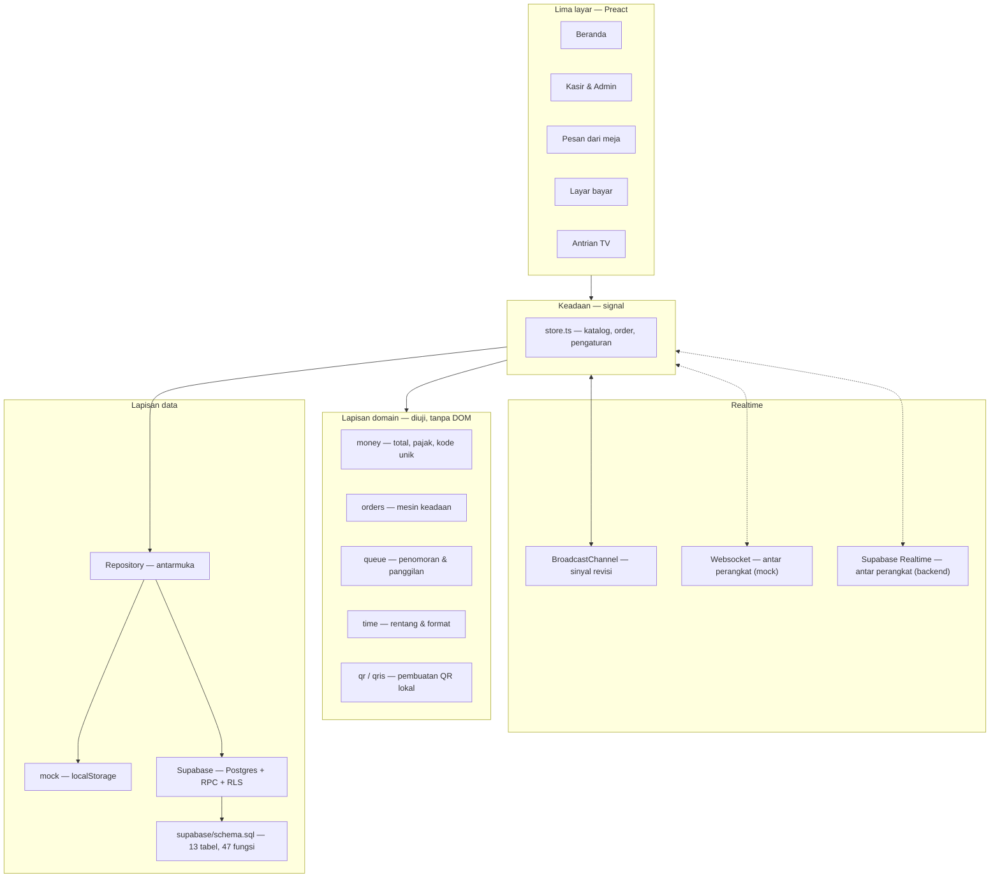

<div align="center">


# byorderkasir

**POS + self-order untuk kafe & resto. Satu basis kode, lima layar, realtime sungguhan.**

[](src/domain)
[](#-ukuran-yang-dikirim-ke-pengguna)
[](#-teknologi-dan-alasannya)
[](LICENSE)

[Lihat layar](#-layarnya) · [Jalankan sendiri](#-jalankan-di-komputer-anda) · [Arsitektur](#-arsitektur) · [Status](#-status-dan-rencana)

</div>

---

Kasir, dapur, pelanggan, dan papan antrian sering berakhir sebagai empat aplikasi terpisah yang saling tidak tahu keadaan. Pesanan yang sudah dibayar masih muncul di tagihan, nomor antrian melompat, dan papan di ruang tunggu menampilkan data yang sudah basi beberapa menit.

**byorderkasir** menyatukannya: satu basis kode, satu sumber kebenaran, dan satu kanal realtime yang membuat semua layar bergerak bersamaan tanpa ada yang perlu menekan tombol muat ulang.

Dibangun sebagai pengganti modern dari aplikasi POS berbasis Google Apps Script + Google Sheets, dengan tiga hal yang di aplikasi lama justru jadi masalah utama:

| | Aplikasi lama | byorderkasir |
|---|---|---|
| **Realtime** | Polling tiap 6 detik | Siaran antar-layar, tanpa polling |
| **Backend** | Google Sheets + Apps Script (plafon 30 eksekusi bersamaan) | Opsional: Postgres + RLS, atau tanpa backend sama sekali |
| **Harga** | Dihitung di browser pelanggan | Lapisan domain; di mode backend dihitung di dalam Postgres |
| **PIN admin** | Tertanam di kode yang dikirim ke browser | Di mode backend: hash di server, tidak ada PIN di klien |
| **Gambar menu** | Tidak ada | Setiap menu punya gambar, ada bawaan otomatis |
| **Struk** | Tabel dua kolom, melar di kertas termal | Daftar linear 80mm, `Rp` konsisten |
| **Ukuran** | 128,8 KB gzip (halaman admin) | 27,2 KB gzip |

---

## 📸 Layarnya

### Papan antrian — ditaruh di TV ruang tunggu

Nomor yang dipanggil tampil besar, sisanya tersusun tiga kolom mengikuti alur kerja dapur. Nama menu panjang turun ke baris kedua, tidak dipotong.


### Kasir — kartu menu bergambar

Setiap menu punya gambar. Belum ada foto? Otomatis dapat gambar bawaan sesuai kategori, jadi daftar tidak pernah tampak kosong.


### Dapur — papan kerja tiga kolom

Kartu berubah warna mengikuti lama menunggu. Tombol aksi berganti sesuai tahap, dan posisinya selalu di ketinggian yang sama supaya tidak salah tekan saat sibuk.


### Bayar — QRIS dinamis di layar pelanggan

Nominalnya disisipkan ke dalam QR, termasuk kode unik, sehingga pembayaran masuk bisa dicocokkan otomatis. QR dibuat di dalam aplikasi — token meja tidak pernah lewat layanan pihak ketiga.


<table>
<tr>
<td width="50%"><br><b>Pesan dari meja</b> — pelanggan memindai QR di meja, memesan langsung dari ponselnya.</td>
<td width="50%"><br><b>Kelola meja</b> — tiap meja punya token sendiri, jadi orang tidak bisa memesan ke meja lain hanya dengan menebak angka.</td>
</tr>
<tr>
<td><br><b>Kelola menu</b> — kategori, harga, HPP, gambar, dan ketersediaan.</td>
<td><br><b>Analitik</b> — omzet, laba kotor, menu terlaris, sebaran jam dan kanal.</td>
</tr>
</table>

<details>
<summary><b>Layar lain</b> (beranda, daftar order, pengaturan)</summary>
<br>
<table>
<tr>
<td width="50%"><br><b>Beranda</b> — pemilih layar.</td>
<td width="50%"><br><b>Daftar order</b> — riwayat dan penyaring.</td>
</tr>
</table>

</details>

---

## 🧭 Lima layar, satu basis kode

| Layar | Alamat | Dipakai oleh | Isi |
|---|---|---|---|
| **Beranda** | `/` | Operator | Pemilih layar, penunjuk arah |
| **Kasir & Admin** | `/admin/` | Kasir, pemilik, dapur | 8 tab: Kasir, Dapur, Order, Menu, Meja, Stok, Analitik, Pengaturan |
| **Pesan dari meja** | `/order/?t=<token>` | Pelanggan | Menu, keranjang, kirim pesanan |
| **Layar bayar** | `/display/` | Pelanggan | Rincian pesanan, tahapan, QRIS |
| **Antrian** | `/queue/` | TV ruang tunggu | Panggilan nomor, tiga kolom, suara |

---

## ✨ Yang membuatnya berbeda

- **Realtime tanpa polling.** Satu kanal siaran (`BroadcastChannel`) menandai perubahan revisi; setiap layar memuat ulang hanya saat datanya memang berubah. Papan antrian ikut bergerak begitu kasir menekan tombol.
- **Harga ditentukan satu tempat.** Pelanggan hanya mengirim `menuId` dan jumlah. Total, pajak, dan kode unik dihitung di lapisan domain — bukan di browser yang bisa diubah siapa saja.
- **Alur pesanan sebagai mesin keadaan.** `pending → processing → ready → completed`, dengan pembatalan yang punya aturan sendiri. Tidak ada transisi liar, dan setiap aturan ada tesnya.
- **Kode unik hanya untuk pembayaran yang membutuhkannya.** QRIS dan transfer dapat kode unik supaya bisa dicocokkan; tunai tidak, karena uangnya sudah di tangan.
- **QR dibuat lokal.** Token meja dan payload QRIS tidak pernah dikirim ke layanan QR pihak ketiga.
- **Struk termal yang benar-benar muat.** 80mm, jarak 3mm, daftar linear — bukan tabel dua kolom yang melar di kertas sempit. Ada juga lembar A4 untuk mencetak QR semua meja sekaligus.
- **Analitik yang jujur.** Semua angka uang hanya menghitung order yang sudah lunas. Order yang belum dibayar ditampilkan terpisah sebagai piutang, tidak diam-diam ikut dihitung sebagai pemasukan.
- **Peran menentukan layar, bukan sekadar label.** Kasir, dapur, dan pemilik masuk dengan akun masing-masing; yang muncul hanya layar yang memang jadi tugasnya. Layar yang tidak diizinkan **dialihkan**, bukan ditolak dengan pesan galat — orang yang salah mengetuk pintu diantar ke pintu yang benar.
- **Realtime sungguhan lintas perangkat.** Bukan `BroadcastChannel` antar-tab, melainkan websocket ke server kecil tanpa dependensi. Satu perangkat menekan "bayar", papan antrian di perangkat lain bergerak. Ada jalur cadangan antar-tab saat server tidak tersedia.
- **Stok dengan riwayat dan peringatan.** Setiap penjualan mencatat pergerakan beserta saldonya, jadi pertanyaan "kenapa stok berkurang 5 padahal penjualan 3" punya jawaban yang bisa dibuka. Bahan yang menipis muncul di atas sebelum dapur kehabisan.
- **Laporan yang bisa dibuka di Excel.** CSV dan `.xlsx` asli — lima sheet, angka tetap bertipe angka, lebar kolom terpasang. Penulis XLSX-nya ditulis sendiri, tanpa dependensi.
- **Tetap jalan saat jaringan putus.** Perubahan masuk antrean tulis di perangkat dan dikirim ulang saat tersambung; ada penanda kecil di header yang menunjukkan ada berapa tulisan menunggu.
- **Backend sungguhan kalau dibutuhkan, opsional.** `supabase/schema.sql` berisi seluruh backend: 13 tabel, 47 fungsi Postgres, dan RLS yang menutup semua jalur tulis. Harga, penomoran order, nomor antrian, dan pemotongan stok dipindahkan ke server — sehingga tidak bisa diubah dari konsol peramban. Yang tidak mengisinya tetap dapat aplikasi yang jalan penuh tanpa backend.
- **Halaman yang sama sekali tidak butuh backend untuk dicoba.** Lapisan data berupa antarmuka dengan implementasi mock; cukup buka, dan semuanya berjalan. SDK Supabase **tidak ikut terunduh** selama adapter-nya masih `mock` — 56,9 KB itu hanya diambil kalau Anda memang menyalakan backend.

---

## 🚀 Jalankan di komputer Anda

Butuh **Node.js 20+**. Tidak ada langkah build tambahan.

```bash
git clone https://github.com/cupizfree/byorderkasir.git
cd byorderkasir
npm install
npm run dev
```

Buka `http://localhost:5173`. Untuk masuk ke panel admin, gunakan tombol **Isi otomatis** di halaman masuk, lalu tekan **Masuk**.

<details>
<summary><b>Menyiapkan data contoh</b></summary>
<br>

Jalankan di konsol browser saat halaman admin terbuka:

```js
const b = window.__byorder;
b.repo.resetDemoData();
await b.repo.seedDemoOrders();
```

`window.__byorder` hanya tersedia di mode pengembangan. Isinya 8 meja, menu lengkap dengan gambar bawaan, dan sepuluh order dengan umur berbeda-beda supaya indikator keterlambatan di layar dapur benar-benar terlihat bekerja.
</details>

<details>
<summary><b>Melihat papan antrian dan layar pelanggan</b></summary>
<br>

Buka di tab terpisah:

- Papan antrian — `http://localhost:5173/queue/`
- Layar pelanggan — `http://localhost:5173/display/`
- Pesan dari meja — `http://localhost:5173/order/?t=demo-token-1`

Biarkan papan antrian terbuka, lalu ubah status sebuah order dari tab admin. Papan itu bergerak sendiri tanpa dimuat ulang — itulah kanal realtime-nya.
</details>

<details>
<summary><b>Menyalakan backend Supabase (opsional)</b></summary>
<br>

Bawaan aplikasi ini adalah mode demo tanpa backend, dan semuanya sudah jalan begitu saja. Kalau Anda ingin data yang benar-benar bersama antar perangkat — dua kasir, satu basis data — ada backend siap pakai di `supabase/`.

**1. Buat proyek Supabase**, lalu buka **SQL Editor**.

**2. Jalankan `supabase/schema.sql`.** Tempel seluruh isinya, jalankan. Ini membuat tabel, fungsi, dan kebijakan aksesnya.

**3. Jalankan `supabase/seed.sql`.** Isinya sama persis dengan data demo mode mock — 22 menu, 5 kategori, 8 meja, dan tiga akun per peran. Aman dijalankan berulang.

**4. Isi berkas `.env`:**

```bash
cp .env.example .env
```

```ini
VITE_DATA_ADAPTER=supabase
VITE_SUPABASE_URL=https://xxxxxxxxxxxx.supabase.co
VITE_SUPABASE_ANON_KEY=eyJhbGciOiJIUzI1NiIsInR5cCI6IkpXVCJ9...
```

Keduanya dari **Project Settings → API**. Kunci anon memang ikut terkirim ke setiap peramban — begitulah cara Supabase bekerja, dan yang membuatnya aman bukan kerahasiaannya melainkan RLS di skema itu. **Jangan** menaruh service role key di sini: kunci itu melewati RLS sepenuhnya, dan apa pun yang berawalan `VITE_` akan ikut ke dalam JavaScript yang diunduh pengunjung.

**5. Jalankan ulang dev server.** Perubahan `.env` baru terbaca saat Vite dinyalakan lagi.

**6. Ganti kata sandi akun demo** sebelum dipakai sungguhan. Akun di `seed.sql` memakai kredensial yang sudah tertulis terbuka di README ini. Cara menggantinya ada di komentar bagian "Akun demo" di dalam `seed.sql`.

Setelah itu, hal-hal yang tadinya tidak mungkin menjadi mungkin: harga dan stok diputuskan server, peran dan sesi diperiksa server, dua kasir berbagi satu basis data, dan tidak ada lagi PIN di dalam bundel JavaScript.

</details>

### Perintah lain

```bash
npm run test        # 282 tes, tanpa kerangka pengujian tambahan
npm run typecheck   # pemeriksaan tipe
npm run check       # keduanya sekaligus
npm run build       # build produksi ke dist/
npm run preview     # pratinjau hasil build
npm run realtime    # server websocket lintas-perangkat di port 8787
```

Ada satu kelompok perintah lagi, untuk backend — lihat [`supabase/uji/`](supabase/uji/). Folder itu punya dependensinya sendiri (`pg`, `libpg-query`) supaya pemasangan aplikasi tidak ikut membawanya, jadi pasang dulu sekali:

```bash
npm --prefix supabase/uji install

npm run db:parse    # periksa kedua berkas SQL dengan parser PostgreSQL asli
npm run db:jalan    # terapkan schema.sql + seed.sql ke Postgres sungguhan
npm run db:uji      # 82 uji fungsional: harga, stok, mesin keadaan, peran, izin
```

Semuanya butuh Postgres yang bisa dihubungi; arahnya diatur lewat `PGHOST`, `PGPORT`, `PGUSER`, `PGPASSWORD`, `PGDATABASE`. `db:siapkan` — yang menjatuhkan database — sengaja tidak didaftarkan di sini; ia menolak berjalan kalau hostnya bukan mesin lokal.

Server realtime itu opsional. Tanpa dijalankan, aplikasi memakai kanal antar-tab dan tetap bekerja — hanya saja dua perangkat berbeda tidak saling melihat. Untuk mencoba lintas-perangkat, jalankan `npm run realtime` di satu terminal, lalu setel alamatnya saat menjalankan dev server:

```bash
VITE_REALTIME_URL=ws://192.168.1.10:8787 npm run dev
```

Ganti alamat itu dengan IP komputer yang menjalankan servernya, supaya ponsel di jaringan yang sama bisa menyambung.

Kalau `VITE_REALTIME_URL` dibiarkan kosong, kanal websocket **tidak dinyalakan sama sekali** — bukan menebak alamat lain. Aplikasi tetap berfungsi penuh lewat kanal antar-tab, hanya saja antar-perangkat tidak tersambung. Untuk mencobanya tanpa membangun ulang, setel dari konsol peramban:

```js
globalThis.__REALTIME_URL = 'ws://192.168.1.10:8787'
```

---

## 🏗 Arsitektur



**Arah ketergantungannya satu arah.** Layar memakai keadaan, keadaan memakai domain dan antarmuka data, domain tidak tahu apa-apa soal layar. Karena itu seluruh aturan uang dan alur pesanan bisa diuji tanpa browser.

**Yang menentukan harga, ditentukan di mana adapternya berada.** Di mode mock, perhitungan ada di lapisan domain yang berjalan di peramban — cukup untuk demo, tapi bisa dibaca dari DevTools. Di adapter Supabase, perhitungan yang sama dikerjakan `app.compute_totals` di dalam Postgres, dan client hanya mengirim niat. Itu sebabnya `CreateOrderInput` sengaja tidak memuat total: tidak ada tempat untuk menaruhnya.

<details>
<summary><b>Struktur folder</b></summary>
<br>

```
src/
├── domain/            Aturan murni, tanpa DOM — semuanya ada tesnya
│   ├── types.ts       Bentuk data: Order, Menu, Payment, StoreSettings
│   ├── money.ts       Total, pajak, kode unik, ringkasan laporan
│   ├── orders.ts      Mesin keadaan pesanan & pembayaran
│   ├── queue.ts       Penomoran antrian & panggilan
│   ├── qr.ts          Pembuatan QR dari nol (uqr)
│   ├── qris.ts        Payload QRIS dinamis
│   └── time.ts        Rentang tanggal & format waktu
├── data/
│   ├── repository.ts  Antarmuka Repository — kontraknya
│   ├── mock/          Implementasi localStorage + data contoh
│   ├── supabase/      Implementasi Postgres + Realtime
│   │   ├── supabaseRepository.ts  29 metode, semuanya lewat fungsi
│   │   ├── client.ts  Kredensial, token sesi, pembungkus galat
│   │   ├── errors.ts  Pemetaan galat server → kode (murni, ada tesnya)
│   │   ├── rows.ts    Pemetaan kolom snake_case → camelCase
│   │   └── realtimeHub.ts  Kanal siaran sinyal revisi
│   ├── load.ts        Pemuatan adapter secara dinamis
│   └── index.ts       Pemilih implementasi
├── state/
│   └── store.ts       Signal, pemuatan, dan jembatan realtime
├── ui/                Komponen bersama: Button, Card, MenuThumb, QrCode
├── surfaces/          Satu folder per layar
│   ├── home/  admin/  order/  display/  queue/
└── styles/
    └── app.css        Token desain, CSS cetak struk & lembar QR

supabase/
├── schema.sql         Seluruh backend: tabel, fungsi, RLS
└── seed.sql           Data demo — sama persis dengan mode mock
```

</details>

---

## 🧰 Teknologi dan alasannya

| Pilihan | Alasan |
|---|---|
| **Preact** | Reaksi yang sama dengan React pada sepersepuluh ukuran — penting karena aplikasi ini juga dibuka dari ponsel pelanggan di jaringan seluler |
| **Vite** | Lima titik masuk dalam satu basis kode, dengan pemuatan terpisah per layar |
| **Tailwind 4** | Token desain di satu berkas; ukuran akhir lebih kecil karena hanya kelas yang dipakai yang ikut |
| **@preact/signals** | Pembaruan keadaan tanpa langganan yang bocor, dan bisa dibaca dari luar komponen |
| **uqr** | QR dibuat di dalam aplikasi, tanpa layanan pihak ketiga |
| **@supabase/supabase-js** | Hanya untuk adapter backend, dan diimpor secara dinamis — 56,9 KB-nya tidak ikut terunduh di mode demo |
| **`node --test`** | Sudah ada di Node — tidak perlu memasang kerangka pengujian |

### Ukuran yang dikirim ke pengguna

Diukur dari hasil build produksi, terkompresi:

| Berkas | gzip |
|---|---|
| Admin (terbesar) | 27,2 KB |
| Inti bersama | 17,4 KB |
| Preact | 8,1 KB |
| QR | 5,4 KB |
| Pesan dari meja | 4,6 KB |
| Antrian | 3,9 KB |
| Layar bayar | 2,4 KB |
| Beranda | 2,0 KB |
| Gaya (semua layar) | 13,0 KB |

Admin tumbuh dari 20,4 KB ke 27,2 KB setelah peran, stok, laporan, dan penulis XLSX masuk. Kenaikannya nyata tapi masih di bawah seperlima aplikasi aslinya (128,8 KB) — dan penulis XLSX ikut di dalamnya, bukan dependensi terpisah.

Menyalakan adapter Supabase menambah dua berkas: SDK-nya **56,9 KB** dan kode adapternya **3,1 KB**. Keduanya hanya diunduh kalau `VITE_DATA_ADAPTER=supabase` — di mode demo tidak ada satu pun berkas HTML yang memuatnya, dan tidak ada satu pun rujukan statis ke sana. Ini sudah diperiksa langsung pada hasil build, bukan diasumsikan dari konfigurasi.

Pelanggan yang memesan dari meja **tidak** mengunduh seluruh aplikasi kasir. Diukur dari berkas yang benar-benar dirujuk `dist/order/index.html`:

| Berkas | Terkompresi |
|---|---|
| Font Plus Jakarta Sans (latin) | 26,8 KB |
| Keadaan, domain & data | 17,4 KB |
| Gaya bersama | 13,0 KB |
| Preact | 8,1 KB |
| Halaman pesan | 4,6 KB |
| Thumbnail menu | 1,2 KB |
| **Total** | **71,1 KB** |

Yang dihitung hanya subset latin. CSS-nya merujuk beberapa subset lain (latin-ext, cyrillic, vietnamese), tetapi peramban hanya mengunduh yang glifnya benar-benar dipakai — jadi berkas-berkas itu tidak pernah terkirim ke pelanggan berbahasa Indonesia, dan itu sebabnya mereka tidak ikut dijumlahkan di sini.

Satu berkas font masih memakan hampir 40% dari total. Memangkasnya lewat subsetting adalah cara termurah untuk menurunkannya lagi — masih di daftar rencana.

---

## ✅ Pengujian

```bash
npm run test
```

**282 tes, semuanya lolos.** Yang diuji adalah aturan yang mahal kalau salah:

- Perhitungan uang: pajak, pembulatan, kode unik, ringkasan laporan
- Kode unik hanya diberikan untuk QRIS dan transfer — tunai tidak
- Hanya order lunas yang masuk omzet; order batal tidak pernah masuk, meski sudah dibayar
- Mesin keadaan pesanan: transisi sah, transisi terlarang, aturan pembatalan
- Penomoran antrian dan pemanggilan ulang
- Tema: penguraian nilai yang tidak dikenal, dan tata letak mana yang dipakai tiap tema
- Geometri QR: zona tenang, ukuran modul, hasil yang bisa dipindai
- Payload QRIS dinamis: nominal tersisip, pemeriksaan jumlah
- Rentang tanggal dan format waktu
- **Izin per peran:** siapa boleh membuka layar apa, dan ke mana dialihkan kalau tidak boleh
- **Aturan panggil antrian:** hanya order yang sudah siap boleh dipanggil, dan syaratnya tidak boleh tertukar dengan syarat transisi status
- **Stok:** saldo sejalan dengan riwayat pergerakan, ambang peringatan, arah dan alasan
- **Antrean tulis luring:** urutan kirim, percobaan ulang, batas percobaan, tulis yang gagal
- **CSV:** pemisah kolom, kutip ganda, awalan anti-rumus, angka negatif tetap angka
- **Laporan:** dasar hitung uang, pembagian margin, judul kolom ikut tertulis
- **XLSX:** ZIP sungguhan, CRC32 lolos, angka tetap bertipe angka, lebar kolom
- **Websocket:** handshake RFC 6455 ditulis tangan, dua klien sungguhan, sambung ulang
- **Pemetaan data backend:** kolom `snake_case` → `camelCase`, dan pengaturan yang belum lengkap tetap menghasilkan bentuk yang utuh — satu bagian yang hilang di basis data tidak boleh menjatuhkan seluruh layar
- **Pemetaan galat backend:** galat jaringan tetap dikenali sebagai jaringan, penolakan aturan bisnis tidak — kalau tertukar, tulisan kasir hilang diam-diam atau antrean berputar selamanya

Aturan uang dan alur pesanan sengaja diletakkan di lapisan domain, bukan di dalam komponen, supaya bisa diuji tanpa browser — dan supaya satu layar tidak bisa menafsirkannya berbeda dari layar lain.

Beberapa tes menjaga kesalahan yang tidak terlihat: berkas Excel yang tetap "berhasil" diunduh dan ukurannya wajar, tapi judul kolomnya hilang. Tesnya membaca bita berkas akhirnya, bukan sekadar bentuk data di memori.

---

## 🗺 Status dan rencana

**Sudah jalan**

- [x] Lima layar dalam satu basis kode
- [x] Realtime antar-layar tanpa polling
- [x] POS: keranjang, diskon, tunai, QRIS, transfer
- [x] Dapur: tiga kolom, indikator keterlambatan, tiket cetak
- [x] Antrian: panggilan, papan TV, pengumuman suara
- [x] Pesan sendiri dari meja lewat token QR
- [x] QRIS dinamis dengan kode unik
- [x] Struk termal 80mm & lembar QR A4
- [x] Gambar menu dengan bawaan otomatis per kategori
- [x] Analitik: omzet, laba, menu terlaris, jam tersibuk
- [x] Masuk dengan peran (kasir / dapur / pemilik) dan izin per layar
- [x] Sinkronisasi lintas-perangkat lewat websocket, bukan hanya antar-tab
- [x] Riwayat stok & peringatan bahan menipis
- [x] Ekspor laporan ke CSV dan Excel
- [x] Mode luring dengan antrean tulis
- [x] Backend Supabase: skema, seed, adapter, dan RLS
- [x] Tiga tema tampilan (Fokus / Gelap / Terang) yang mengganti warna **dan** tata letak, dipilih per perangkat
- [x] 282 tes, pemeriksaan tipe bersih

**Berikutnya**

- [ ] **Uji backend terhadap proyek Supabase sungguhan.** Skema dan seed sudah dijalankan terhadap Postgres 18.4 sungguhan (97 pernyataan, 82 uji fungsional lolos), tetapi belum terhadap proyek Supabase — Realtime, PostgREST, dan peran bawaan Supabase belum tersentuh — lihat "Batasan yang jujur" di bawah
- [ ] Pencocokan pembayaran masuk dari penyedia QRIS
- [ ] Subset font agar halaman pelanggan turun dari 71,1 KB
- [ ] Webhook QRIS supaya pembayaran tercatat sendiri tanpa kasir menekan "Lunas"

### Batasan yang jujur

Agar tidak ada salah paham sebelum Anda memakainya:

- **Backend Supabase sudah dijalankan terhadap Postgres sungguhan, tapi belum terhadap proyek Supabase.** Skema dan seed dijalankan pada Postgres 18.4 yang berjalan di mesin ini: 97 pernyataan mendarat bersih, lalu 82 uji fungsional memanggil fungsinya satu per satu — membuat order, memotong stok, menolak transisi status yang tidak sah, mengembalikan stok saat dibatalkan, menolak pengunjung anonim. Uji itu menemukan lima cacat yang tidak terlihat oleh parser mana pun, termasuk satu yang membuat **setiap** `create_order` gagal. Yang **belum** terbukti: perilakunya di dalam Supabase sendiri — Realtime, PostgREST, peran bawaan Supabase, dan jalur jaringan dari peramban belum tersentuh sama sekali. Perlakukan ini sebagai backend yang sudah terbukti logikanya, bukan yang sudah terbukti di produksi.
- **Mode demo tetap punya batasan lamanya.** Tanpa `VITE_DATA_ADAPTER=supabase`, data masih hidup di `localStorage` peramban: satu perangkat satu salinan, dan yang menang saat bentrok adalah yang terakhir dikirim. Harga juga masih dihitung di peramban. Semua itu hilang begitu backend dinyalakan.
- **Server realtime-nya masih perlu dijalankan sendiri** untuk mode mock. `npm run realtime` menyalakannya di port 8787; kalau tidak ada, aplikasi turun ke jalur antar-tab dan tetap jalan. Di adapter Supabase ini tidak berlaku — Realtime-nya ditangani Supabase.
- **Akun demo memakai kredensial yang terbuka di repositori ini.** Di Supabase, sandi dan PIN-nya tersimpan sebagai hash bcrypt dan verifikasinya di server, tapi selama Anda belum menggantinya, siapa pun yang pernah membaca README ini tahu cara masuk sebagai pemilik. Cara menggantinya ada di komentar bagian "Akun demo" di `supabase/seed.sql`.
- **Pembayaran belum terhubung ke penyedia.** QRIS yang dihasilkan sudah benar dan bisa dipindai, tetapi pencocokan pembayaran masuk masih perlu webhook dari penyedia.

---

## ❓ Pertanyaan yang sering muncul

<details>
<summary><b>Apakah bisa dipakai tanpa internet?</b></summary>
<br>
Tergantung adapternya. Di mode <code>mock</code>, aplikasi terbuka tanpa jaringan dan seluruh data ada di <code>localStorage</code>; perubahan yang gagal terkirim masuk antrean tulis dan dikirim ulang begitu jaringan kembali. Yang tidak bisa dilakukan di mode itu adalah berbagi data antar perangkat tanpa jaringan. Di adapter <code>supabase</code>, data memang satu di server, jadi jaringan diperlukan — tapi antrean tulis yang sama tetap meredam putus-putus sesaat, dan kasir bisa terus melayani.
</details>

<details>
<summary><b>Perlu backend atau tidak?</b></summary>
<br>
Kalau Anda hanya ingin mencoba, tidak. Buka saja — semuanya jalan, termasuk realtime antar-tab, stok, ekspor, dan mode luring.<br><br>
Kalau dipakai di kedai sungguhan, iya, dan <code>supabase/schema.sql</code> sudah menyiapkannya. Tiga hal yang tidak bisa benar tanpa backend: <b>harga</b> (di mode demo dihitung di peramban, jadi bisa diubah dari konsol), <b>peran dan sesi</b> (PIN-nya ada di bundel JavaScript), dan <b>data bersama</b> (dua kasir butuh satu basis data, bukan dua salinan yang saling menimpa).<br><br>
Menyalakannya tidak mengubah satu baris pun di lapisan tampilan — itu yang jadi alasan <code>Repository</code> dibuat sebagai antarmuka sejak awal.
</details>

<details>
<summary><b>Kenapa skema SQL-nya tidak punya policy INSERT atau UPDATE?</b></summary>
<br>
Karena itu memang disengaja. RLS menyala di semua tabel, policy SELECT hanya dibuat untuk katalog dan pengaturan — dan tidak ada satu pun policy tulis. Artinya kunci anon, yang memang ikut terkirim ke setiap peramban pengunjung, tidak bisa mengubah apa pun.<br><br>
Seluruh penulisan harus lewat fungsi Postgres, dan setiap fungsi memeriksa token sesi serta peran lebih dulu. Harga, nomor order, nomor antrian, dan pemotongan stok ditentukan di dalam fungsi itu — client hanya mengirim niat, bukan hasil hitungan.<br><br>
Bandingkan dengan aplikasi aslinya, yang endpoint admin-nya terbuka: siapa pun yang tahu alamatnya bisa membaca dan mengubah data tanpa masuk.
</details>

<details>
<summary><b>Kenapa Preact, bukan React?</b></summary>
<br>
Pelanggan membuka halaman pesan dari ponsel di jaringan seluler kafe. Preact memberi cara menulis yang sama dengan React pada ukuran yang jauh lebih kecil — sekitar 8 KB gzip untuk intinya. Tidak ada yang perlu ditulis ulang kalau nanti pindah.
</details>

<details>
<summary><b>Bagaimana kalau kertas struk bukan 80mm?</b></summary>
<br>
Ukuran kertas diatur lewat <code>@page</code> bernama di <code>src/styles/app.css</code>. Untuk 58mm, ubah lebar pada blok <code>.struk</code>. Lembar QR A4 memakai <code>@page</code> terpisah, jadi keduanya bisa dicetak dalam satu sesi tanpa saling mengganggu.
</details>

<details>
<summary><b>Apakah nomor antrian bisa mulai dari angka tertentu tiap hari?</b></summary>
<br>
Bisa. Penomoran ada di <code>src/domain/queue.ts</code> dan dihitung dari urutan order pada rentang tanggal — jadi nomornya otomatis kembali ke awal setiap hari, tanpa perlu direset manual.
</details>

<details>
<summary><b>Kenapa tidak ada <code>innerHTML</code> di mana pun?</b></summary>
<br>
Semua SVG, termasuk QR, dibangun sebagai elemen. Selain menghindari risiko penyisipan, ini membuat hasilnya bisa diperiksa langsung di pohon DOM — berguna saat menguji apakah QR yang dihasilkan benar-benar bisa dipindai.
</details>

---

## 🤝 Ikut mengembangkan

```bash
npm run check    # jalankan sebelum mengirim perubahan
```

Aturan yang dipegang di proyek ini:

1. Aturan bisnis masuk ke `src/domain/`, dan disertai tes.
2. Harga tidak pernah dihitung di komponen layar.
3. Perubahan status order lewat mesin keadaan, bukan penetapan langsung.
4. Tanpa `innerHTML`. Bangun elemen.
5. **Penulisan hanya lewat fungsi.** Di `supabase/schema.sql` tidak ada policy INSERT / UPDATE / DELETE, dan tidak boleh ditambahkan — begitu satu policy tulis dibuat, kunci anon yang ada di setiap peramban pengunjung bisa memakainya.
6. **Perubahan skema harus ikut `supabase/seed.sql`.** Data demo di kedua adapter sengaja identik (id menu, token meja); kalau salah satu tertinggal, demonya jadi berbeda tergantung adapter.
7. **Aturan yang sudah ada di server jangan diulang di client.** Kalau `create_order` sudah menentukan harga, adapter tidak boleh ikut menghitungnya — dua sumber kebenaran berarti yang di client selalu kalah, dan yang kalah itu tidak terlihat sampai ada yang menyalahgunakannya.

---

## 📄 Lisensi

MIT — lihat [LICENSE](LICENSE).

<div align="center">
<br>
<sub>Dibangun untuk kafe kecil yang ingin layarnya rapi tanpa berlangganan empat aplikasi berbeda.</sub>
</div>
